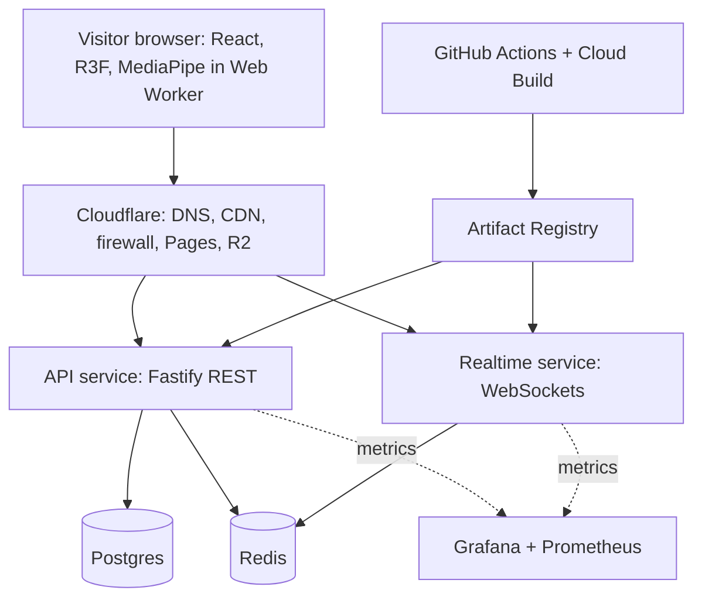

# The Waiting Room: system design

Working name. One shared 3D room where every visitor is a floating hand. Portfolio projects live in the room as objects. Built to learn how real systems are designed, shipped and run.

## 1. Goals and non-goals

**Goals**

- Fun and shareable within 10 seconds, with no signup and no install.
- Works on laptop, phone and tablet (touch/mouse fallback when there is no webcam).
- Real multiplayer: visitors see each other's hands live.
- A real pipeline: CI/CD, containers, managed database, cache, monitoring.

**Non-goals (for now)**

- User accounts, login, or free-text chat (moderation risk).
- Server-side physics (added late, if at all).
- Native mobile apps.

## 2. Requirements

**Functional**

- F1. Visitor lands in a room and gets an auto-generated funny nickname.
- F2. Visitor controls a hand by webcam (MediaPipe) or mouse/touch.
- F3. Visitors in the same room see each other's hands and shared objects move live.
- F4. Guestbook: post an emoji plus nickname, see recent entries on the wall.
- F5. Leaderboard for a mini-game (added later).
- F6. Record and share a short clip (added later).

**Non-functional**

- Realtime latency under 150 ms round trip for most visitors.
- 30 FPS on a mid-range phone (quality tiers reduce effects on weak devices).
- First load under 5 s on 4G (compressed models, lazy loading, CDN).
- Webcam video never leaves the device.
- Abuse-resistant: rate limits, emoji-only input.
- Deploys are automatic, and a bad deploy can be rolled back in minutes.

## 3. Architecture



**Why two backend services?** The API is short request/response traffic (guestbook). The realtime service holds thousands of long-lived connections and ticks continuously. They scale differently and fail differently, so they are separate.

**Why is the frontend not in a container?** It is static files (HTML, JS, 3D models). Cloudflare Pages serves them from the edge for free. Containers are for code that has to run on a server.

## 4. Key flows

**Page load.** Browser asks DNS for the domain (Cloudflare) → Cloudflare serves the static site from its CDN → 3D assets stream from R2 (cached at the edge) → app opens a WebSocket to the realtime service.

**Hand loop (the hot path).**

1. Client tracks the hand locally (worker thread) and sends `hand` about 15 times per second.
2. Realtime server keeps the latest state per visitor in memory.
3. Every tick (about 15 Hz) the server sends each client one `snapshot` with all hands and objects in that room. Batching into ticks (instead of forwarding every message) is the main trick that keeps outbound traffic manageable.
4. Clients interpolate between snapshots so movement looks smooth.

**Guestbook post.** Client → `POST /guestbook` → rate limit check (Redis) → validate with Zod → insert into Postgres → return entry → other visitors see it via a realtime `event`.

## 5. Data model

**Postgres** (durable data)

- `guestbook_entries(id uuid pk, nickname text, emoji text, created_at timestamptz)`
- `scores(id uuid pk, nickname text, score int, created_at timestamptz)`
- `clips(id uuid pk, r2_key text, created_at timestamptz)` (later)

**Redis** (fast, disposable data)

- `rate:{ip}:{action}`: counter with a TTL (rate limiting)
- `presence:count`: how many people are online
- `leaderboard:daily`: sorted set
- Pub/Sub channel per room, used only when we scale to several realtime instances

Rule of thumb: if losing it would hurt, it goes in Postgres. If it can be rebuilt or expires, it goes in Redis.

## 6. Contracts

Schemas live in `packages/shared` as Zod types, and both frontend and backend import them, so they cannot drift apart.

**REST**

- `GET /health`
- `GET /guestbook?cursor=`
- `POST /guestbook`
- `GET /leaderboard`
- `POST /scores`
- `POST /clips/upload-url` (later, returns a presigned R2 upload URL)

**WebSocket messages** (JSON first, binary later if bandwidth matters)

- client → server: `hello`, `hand {x,y,z,pinch}`, `grab {objectId}`, `release`, `emoji`
- server → client: `welcome {selfId, roomId, nickname}`, `snapshot {tick, hands[], objects[]}`, `event {type, payload}`

## 7. Capacity estimate (rough, to be checked by load testing)

Assume rooms of at most 30 visitors and 15 ticks per second.

- Inbound per room: 30 × 15 = 450 messages/s.
- Outbound per room with batching: 450 snapshots/s, each about 300 bytes, so roughly 135 KB/s.
- 1,000 concurrent visitors is about 34 rooms, so roughly 4.5 MB/s outbound. One modest Node instance should cope; the load test in Phase 7 tells us the truth.
- Without batching, forwarding every message to every peer would be about 13,000 messages/s per room. That is why we batch.

## 8. Failure modes and abuse

| Problem                                    | Response                                                                                     |
| ------------------------------------------ | -------------------------------------------------------------------------------------------- |
| Visitor has no webcam or denies permission | Mouse/touch fallback, always available                                                       |
| Weak phone drops below 30 FPS              | Automatic quality tier (fewer effects, smaller textures)                                     |
| Realtime instance restarts                 | Client auto-reconnects with backoff (also needed because Cloud Run caps connection length)   |
| Redis is down                              | Site still works; rate limiting fails safe and presence hides                                |
| Postgres is down                           | Guestbook shows an error state; the room keeps working                                       |
| Spam or abuse                              | Emoji-only input, per-IP rate limits, Cloudflare firewall rules                              |
| Traffic spike after going viral            | Cloud Run max-instances cap to protect the bill, room cap of 30, overflow creates a new room |
| Empty room feels dead                      | Ghost hands replaying earlier visitors                                                       |

## 9. Deployment: how the pieces fit

**Container vocabulary**

- **Image**: a frozen package of your backend code plus everything it needs (Node, dependencies). Built from a Dockerfile.
- **Container**: a running copy of an image.
- **Pod** (Kubernetes): a small wrapper around one container (usually). The unit Kubernetes starts and stops.
- **Node**: a machine (VM) that runs pods. **Cluster**: a group of nodes.
- **Deployment**: "keep 3 copies of the API running, replace them one by one on updates."
- **Service / Ingress**: a stable internal address and the front door that spreads traffic across pods.

The backend is not separate from containers: the backend code is what is inside them. The database is usually not run inside Kubernetes. It is a managed service the containers connect to over the network with a connection string kept in secrets.

**Domain and URLs.** You still need a domain. Kubernetes and Cloud Run give you technical addresses only. The chain is: visitor types domain → Cloudflare DNS → Cloudflare edge (cache, firewall) → Google load balancer or Cloud Run → your container.

- `yourdomain.dev` → Cloudflare Pages (frontend)
- `api.yourdomain.dev` → API service
- `rt.yourdomain.dev` → realtime service

**No local Docker needed.** Write the Dockerfile locally; let cloud builders (Cloud Build or GitHub Actions) build the image. Google Cloud Shell (browser terminal) has Docker for quick tests.

**Environments:** local (Node run directly, cloud dev database) → staging → production. Same images across all of them; only configuration changes.

**Pipeline:** open pull request → lint, type-check and tests → merge to main → build images → push to Artifact Registry → run database migrations → deploy to staging → smoke test → manual approval → production. Roll back by redeploying the previous image.

**Hosting path:** start on Cloud Run (managed containers, scales to zero) and move to GKE Autopilot (Kubernetes) in Phase 8 once there is something worth orchestrating.

## 10. Repository layout

```
waiting-room/
  apps/
    web/          React + Vite frontend
    api/          Fastify REST service
    realtime/     WebSocket service
  packages/
    shared/       Zod schemas and types used by all apps
  infra/
    docker/       Dockerfiles
    k8s/          Kubernetes manifests (Phase 8)
  docs/
    DESIGN.md     this file
    decisions/    short notes on why we chose things
  .github/workflows/
```

## 11. Build phases

Each phase ends with something deployed and working.

1. **Walking skeleton.** Empty page on Cloudflare Pages, `/health` on Cloud Run, CI/CD running end to end. Boring on purpose: it proves the pipeline before features exist.
2. **The room.** 3D scene, mouse hand, project objects. Test on phone, tablet and ultrawide from the start.
3. **Guestbook slice.** First full vertical slice: UI, API, Postgres, validation, tests.
4. **Live hands.** Realtime service, snapshots, interpolation (mouse hands only).
5. **Redis.** Rate limiting, presence counter, leaderboard.
6. **Webcam hands.** MediaPipe in a Web Worker, with quality tiers.
7. **Observability and load test.** Metrics, Grafana, Sentry, k6 tests. Find the breaking point on purpose.
8. **Scale-out.** Several realtime instances via Redis Pub/Sub, then move to GKE.
9. **Share and polish.** Clip recording, ghost hands, launch.

## 12. Cost guardrails

- Set billing budget alerts before creating anything.
- Cap Cloud Run max instances. Keep minimum instances at 0 (realtime may need 1 later).
- GKE and managed Redis/Postgres can bill continuously, so tear down what is unused and check current pricing first. Free tiers on Neon and Upstash are options for the early phases.

## 13. Antigravity prompting playbook

**Always work in vertical slices.** One feature per prompt, covering frontend, backend, database, shared types and tests together, so the app is never half-built.

**Slice prompt template**

```
Context: <one sentence on the project, point to docs/DESIGN.md>
Goal: <the single feature>
Contract first: define/update the Zod schemas in packages/shared for <messages/endpoints>
Backend: <routes/handlers, DB changes with a migration, rate limit>
Frontend: <components, TanStack Query usage, loading and error states>
Tests: <what to test>
Constraints: no new dependencies without asking; no unused code; follow existing structure
Out of scope: <things not to touch>
Acceptance: <how I will verify it works>
First: show me your plan and the files you will change. Do not write code yet.
```

**Habits**

- Ask for a plan before code, read it, then approve.
- Commit after every working slice, so you can always go back.
- Never accept a dependency you cannot explain.
- After each slice, ask it to explain what it wrote, and write a short note in `docs/decisions/`.
- Keep a short rules file or pasted preamble: tech stack, folder structure, "no fluff, no dead code, small functions."

## 14. Open decisions

- Final name and visual style of the room.
- Managed Postgres/Redis provider (Google's own vs. Neon/Upstash), decided by cost.
- Whether shared-object physics (Rapier) is worth the complexity, decided after Phase 4.
- Domain name.
